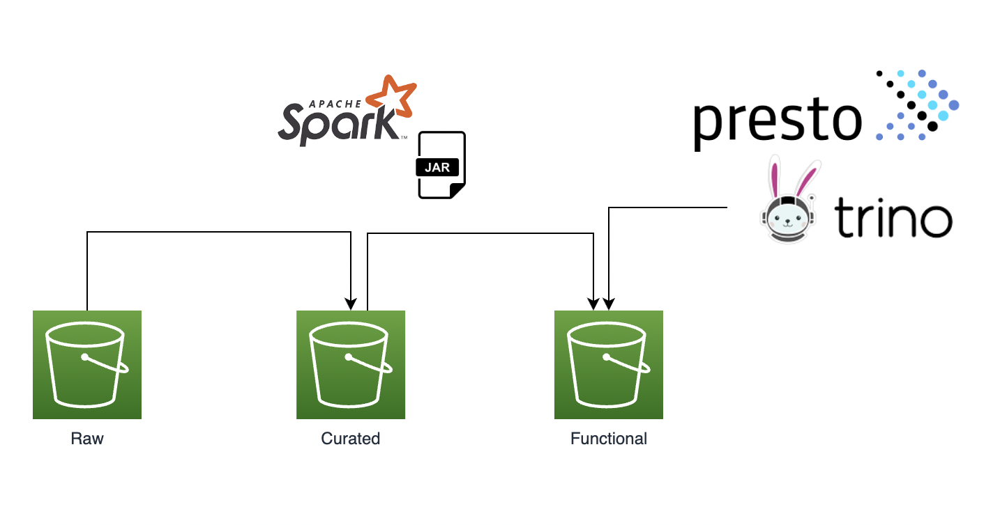
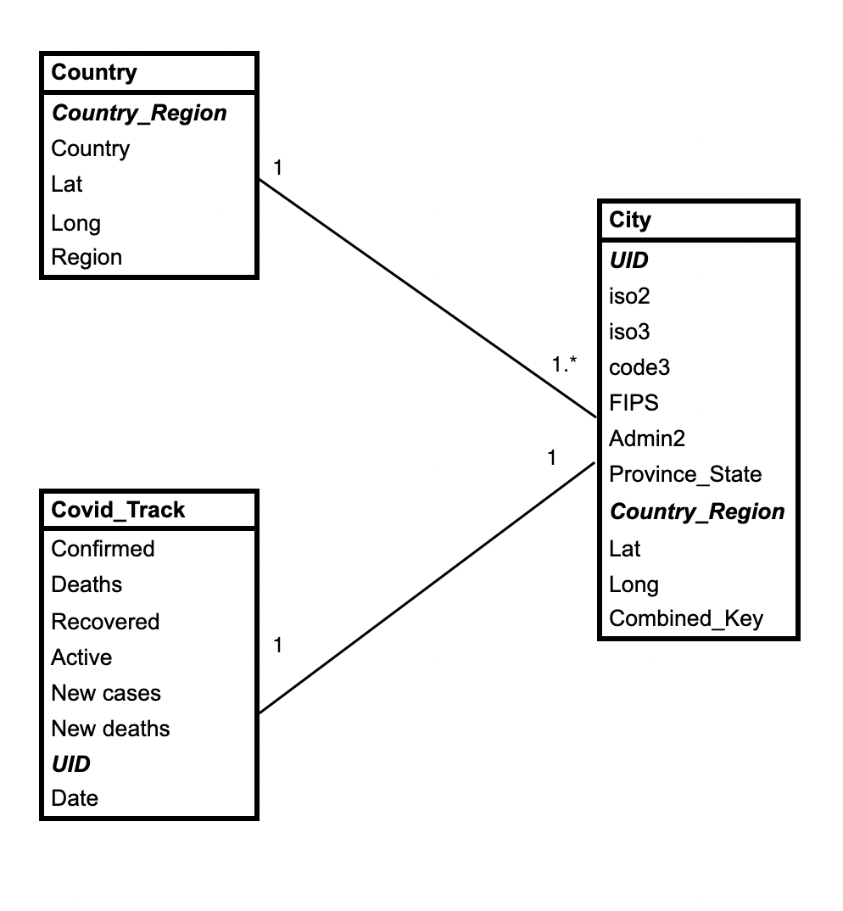

# CovidN5

## Caso de Uso

Se entendio los archivos CSV de kaggle como el resultado final de logica aplicada a objetos, por lo cual se realizo ingenieria inversa para lograr obtener los datos de los objetos

## Arquitectura

Se tiene pensado una arquitectura de 3 capas, no se estan usando objects storages para almacenar la data, sino directores dentro del proyecto scala:

 - Raw - los datos en formato parquet sin casteo de datos.
 - Curated - los datos en formato parquet con casteo de datos basado en clases.
 - Funcional - la union de los datos limpios mas agregacion dependiendo a la logica, la ultima capa seria la consumida por queries enginen como Presto o Trino.
 
 ## ER
 
 

Se identifico tres entidades:

 - Country - Contiene informacion del pais
 - City - Contiene informacion de la ciudad
 - Covid_track - Contiene la informacion del tracking del covid por ciudad por dia, informacion como muertos, recuperados, activos, etc.
 
 
 ## Codigo
 
 Consta de 3 objetos/funciones principales, una para cada capa.
 
 RawLayer.runRawLayer - lee los archivos csv usando RDDs como se solicito, para almacenarlo en parquet se convierte a un DataFrame pero con una structura de strings.
 
 CuratedLayer.runCuratedLayer - lee los archivos de la capa Raw y castea todos los campos automaticamente usando un case class como structura.
 
 FuncionalLayer.RunFuncionalLayer - teniendo ya los datos tipificados, se procede a hacer los joins y agregaciones para obtener los datos de los CSVs de kaggle, como los datos vendrian por dia, se estaria particionando la data por el campo dia.
 
 
## Mejoras

Utilizar un metastore como Hive Metastore o AWS Glue para el consumo mas rapido de la data entre objetos
 